# 🏥 Hospital Weka Analysis

This repository presents an extensive attribute-wise and cluster-wise exploratory analysis of hospital patient data using Weka. From EM and K-Means clustering models to classification summaries and visual breakdowns of key features like fever, blood pressure, and diagnosis—each chart is Weka-generated and interpreted without any third-party transformation.

---

📂 Project Structure

```bash
Hospital-Weka-Analysis/
├── data/
│   └── hospital_dataset.arff               # Synthetic hospital data for clustering & classification
├── outputs/                                # All Weka-generated visualizations (see below)
│   ├── IMG-20250706-WA0014.jpg
│   ├── IMG-20250706-WA0017.jpg
│   ├── IMG-20250706-WA0015.jpg
│   ├── IMG-20250706-WA0012.jpg
│   ├── IMG-20250706-WA0013.jpg
│   ├── IMG-20250706-WA0016.jpg
│   ├── 1000071664-Pleasant-ImageEnhancer.jpg
│   ├── IMG20250706231025.jpg
│   ├── IMG20250706231042.jpg
│   ├── IMG20250706231115.jpg
│   ├── IMG20250706231152.jpg
│   ├── IMG20250706231100.jpg
│   ├── IMG20250706231209.jpg
│   ├── IMG20250706231130.jpg
│   └── IMG20250706231227.jpg
├── README.md                               # This documentation
└── LICENSE                                 # MIT License
```

---

# 📊 Visualizations (Ordered from outputs/)

`markdown

### 1. EM Clustering Summary
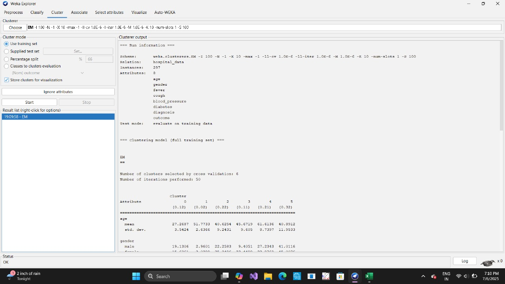

### 2. Gender Distribution
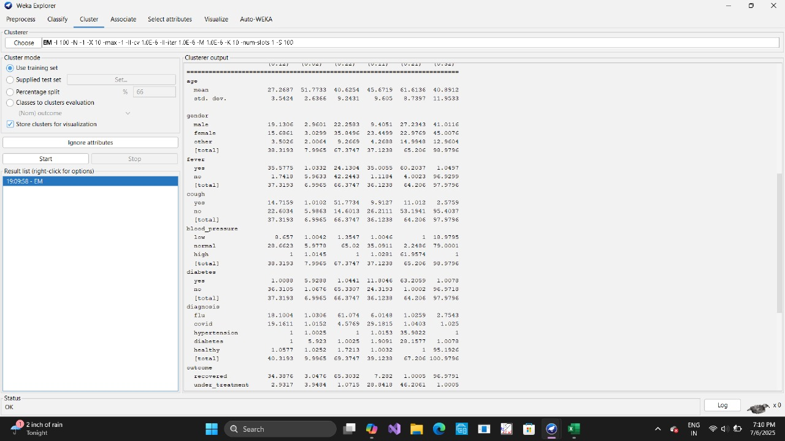

### 3. Fever Analysis Across Clusters
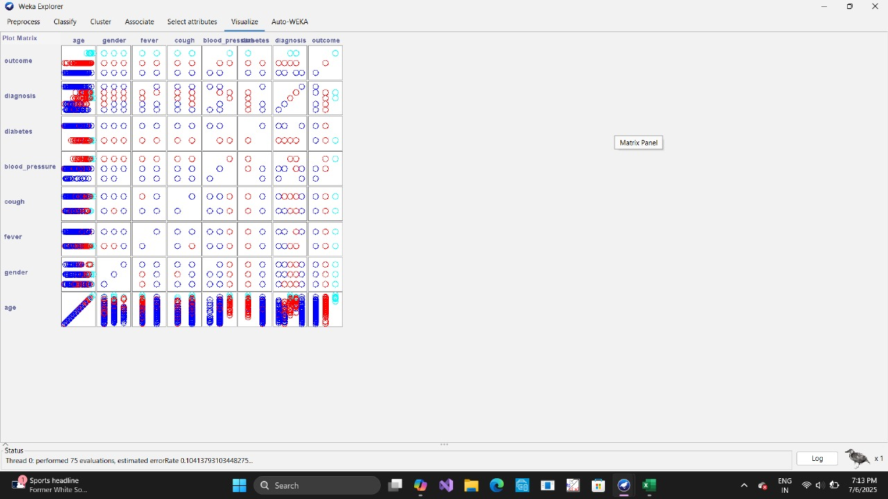

### 4. Cough Comparison by Cluster
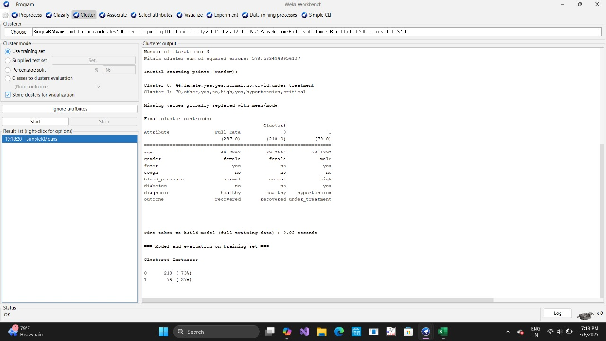

### 5. Blood Pressure Visualization
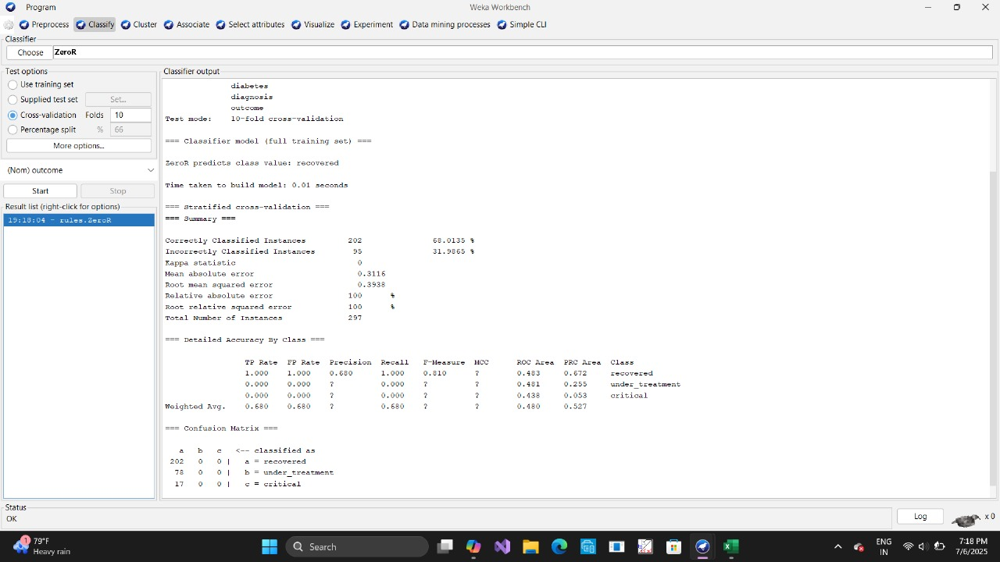

### 6. Diabetes Attribute Distribution
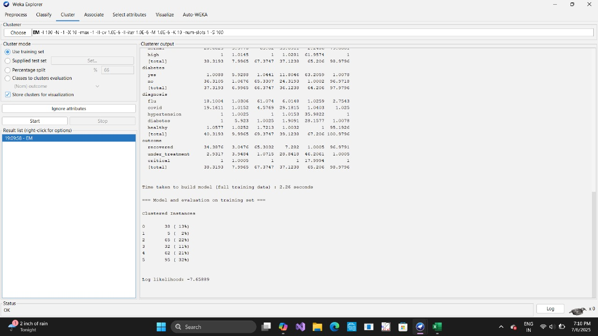

### 7. Diagnosis Breakdown


### 8. Outcome Classification
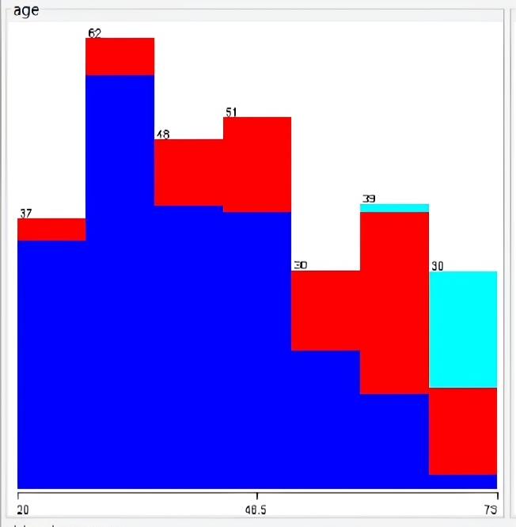

### 9. Attribute Plot Matrix
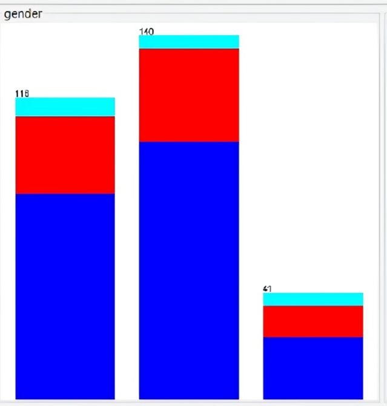

### 10. SimpleKMeans Summary
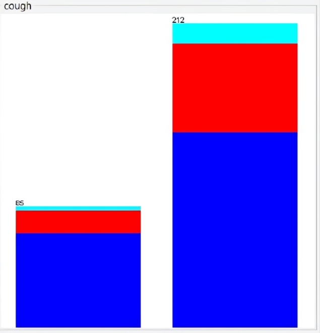

### 11. KMeans Performance Details
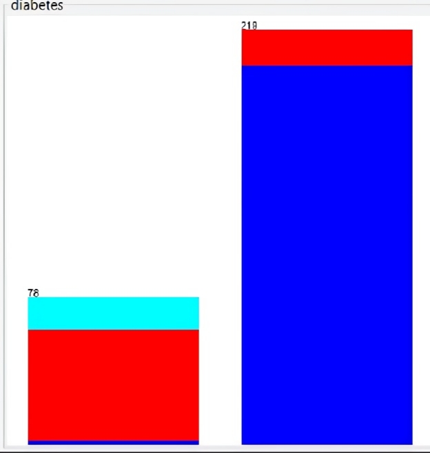

### 12. ZeroR Model Summary
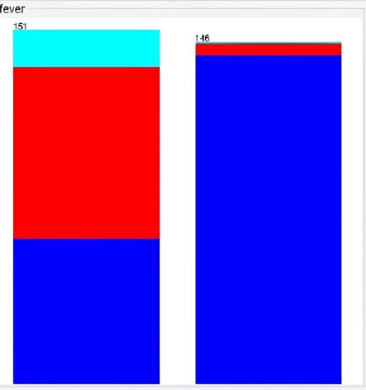

### 13. Confusion Matrix & Accuracy
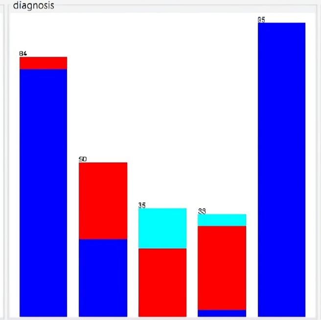

### 14. Diabetes-Diagnosis-Outcome Panel
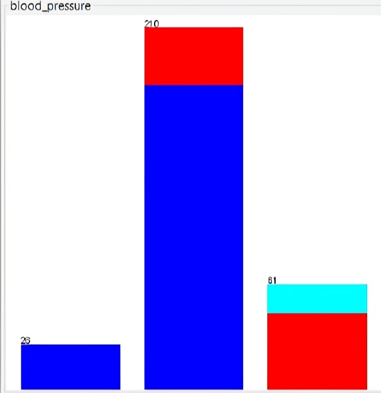

### 15. Final Weka Interface Snapshot
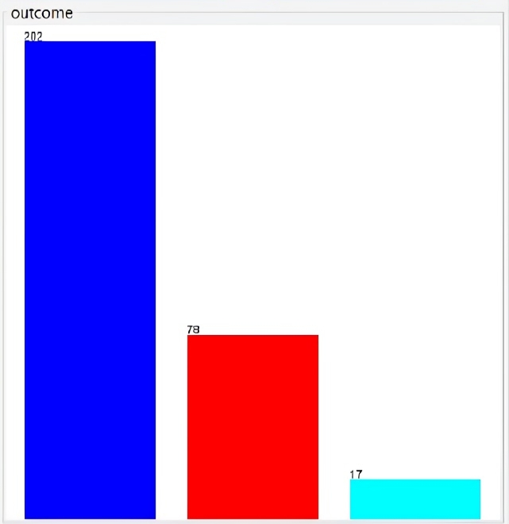
---

# 🔍 Summary

### The project demonstrates how Weka can be leveraged to:

- Perform unsupervised clustering (EM, K-Means) on hospital patient attributes
- Evaluate key factors such as fever, cough, blood pressure, and diabetes in relation to diagnoses
- Run classification models like ZeroR, producing confusion matrices and accuracy evaluations
- Visualize all attributes with minimal preprocessing, directly from .arff input

Whether you're exploring patient segmentation or diagnostic prediction, this project serves as a blueprint for health-data-driven clustering and analysis using Weka’s GUI tools.

---

# 🧾 License

Released under the MIT License  
© 2025 by Gyanankur Baruah

---
